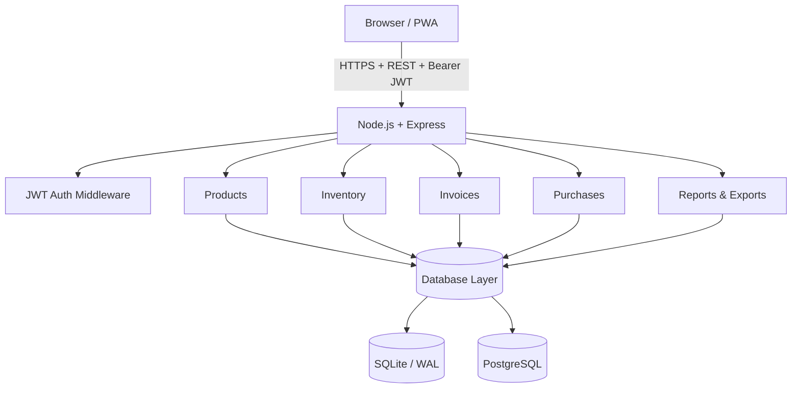
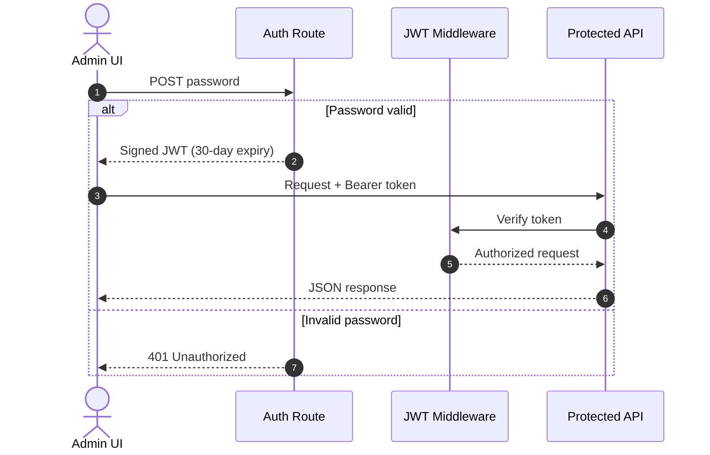

# Ledgerly — Technical Architecture

This document describes the technical architecture of **Ledgerly**, including its application layers, database model, authentication flow, deployment model, and PWA/offline behavior.

---

## 1. Architectural Principles

Ledgerly is built around three core principles:

1. **Dual-database flexibility** — Run locally with SQLite and no database server, or use PostgreSQL for cloud and multi-device deployments.
2. **Deterministic and reversible inventory operations** — Stock changes are represented through explicit `IN`, `OUT`, and `ADJUST` transactions, while destructive operations can be reversed through compensating inventory changes.
3. **Compliance-oriented data structures** — Sales and purchase data are organized to support CA-oriented Excel reports and structured GST export workflows.

---

## 2. System Architecture

At a high level, the application is a browser-based frontend backed by an Express REST API. Authentication is handled through JWTs, while the backend can route persistence to either SQLite or PostgreSQL.



### Application Layers

| Layer | Responsibility |
|---|---|
| Presentation | HTML, Vanilla JS, CSS, PWA assets |
| API | Express routes and HTTP request handling |
| Authentication | Login endpoint and JWT middleware |
| Domain operations | Billing, inventory, purchases, reports, exports |
| Persistence | SQLite or PostgreSQL |
| Deployment | Local Node process or Netlify serverless adapter |

---

## 3. Database Architecture

Ledgerly maintains the same logical relational model across SQLite and PostgreSQL.

### Entity Relationship Model

```text
[products] 1 ──── 1 [inventory]
    │                  │
    ├── 1:N ── [invoice_items] ── N:1 ── [invoices]
    ├── 1:N ── [purchase_items] ── N:1 ── [purchases]
    └── 1:N ── [stock_transactions]
```

### `products` — Product Master

| Field | Type | Description |
|---|---|---|
| `id` | SERIAL / INTEGER PK | Unique product identifier |
| `name` | TEXT UNIQUE | Product name and packaging variant |
| `net_qty` | TEXT | Volume / net quantity, e.g. `2 LTR` |
| `pcs_per_box` | INTEGER | Units contained in one wholesale box |
| `selling_rate` | REAL | Taxable selling rate per box |
| `purchase_rate` | REAL | Purchase/cost price per box |
| `category` | TEXT | Product category |
| `hsn_code` | TEXT | HSN/SAC code |
| `is_active` | INTEGER | Active status flag |

### `inventory` — Current Stock

| Field | Type | Description |
|---|---|---|
| `id` | SERIAL / INTEGER PK | Inventory record identifier |
| `product_id` | INTEGER FK | References `products.id` |
| `stock_boxes` | REAL | Current quantity on hand in box units |
| `last_purchase_rate` | REAL | Most recent inward purchase rate |

### `stock_transactions` — Inventory Audit Ledger

| Field | Type | Description |
|---|---|---|
| `id` | SERIAL / INTEGER PK | Transaction identifier |
| `product_id` | INTEGER FK | References `products.id` |
| `type` | TEXT | `IN`, `OUT`, or `ADJUST` |
| `boxes` | REAL | Quantity delta |
| `purchase_rate` | REAL | Cost price at transaction time |
| `reference` | TEXT | Source reference such as an invoice or purchase |

The ledger provides the historical movement trail, while `inventory` provides the current stock snapshot.

---

## 4. Dual Database Layer

The active database provider is selected at runtime using `DATABASE_URL`.

```javascript
const { DATABASE_URL } = process.env;

if (DATABASE_URL) {
    // PostgreSQL / cloud mode
    const { Pool } = require('pg');

    pool = new Pool({
        connectionString: DATABASE_URL,
        ssl: { rejectUnauthorized: false }
    });
} else {
    // SQLite / local mode
    const Database = require('better-sqlite3');

    db = new Database('./data/ledgerly.db');
}
```

### SQLite

- Uses `better-sqlite3`.
- WAL mode is enabled for improved read/write concurrency.
- Foreign-key enforcement is enabled.
- The database is stored locally as `./data/ledgerly.db`.

### PostgreSQL

- Uses the `pg` connection pool.
- Parameterized queries are used for database operations.
- SSL connection handling supports hosted PostgreSQL deployments.
- Suitable for cloud and multi-device deployments.

### Design Trade-off

The dual-database approach keeps local installation simple without locking the application into a single deployment model. SQLite is the default for low-overhead local use; PostgreSQL is the intended persistence layer when centralized access is required.

---

## 5. Authentication & Security Flow

Sensitive API routes are protected by JWT authentication.



### Authentication Model

1. The admin submits the configured password to `/api/auth/login`.
2. The server validates the credentials.
3. A signed JWT is returned with a 30-day lifetime.
4. The frontend sends the token using the `Authorization: Bearer <token>` header.
5. Protected routes validate the token before processing the request.

> **Production note:** `JWT_SECRET` and `ADMIN_PASSWORD` should always be replaced with strong, unique secrets and stored through the deployment environment rather than committed to source control.

---

## 6. Inventory Consistency & Reversible Operations

Inventory changes are tied to business events rather than treated as isolated number edits.

### Invoice Flow

```text
Create Invoice
     │
     ├── Validate items
     ├── Calculate GST
     ├── Record invoice
     ├── Deduct inventory
     └── Write OUT transaction
```

### Purchase Flow

```text
Record Purchase
     │
     ├── Validate items
     ├── Calculate purchase values
     ├── Record purchase
     ├── Increase inventory
     └── Write IN transaction
```

### Reversal

When an invoice or purchase is deleted through the supported reversible workflow, the corresponding inventory quantities are restored rather than simply disappearing from the stock history.

This keeps the current stock balance aligned with the underlying business operations while retaining the transaction trail.

---

## 7. GST & Reporting Layer

Ledgerly separates operational data from export formats so the same sales and purchase records can serve multiple reporting workflows.

### Sales Reporting

The sales layer supports:

- Date-range filtering.
- Revenue and tax aggregation.
- Itemized Sales Register generation.
- Excel (`.xlsx`) export through `exceljs`.
- Structured GST JSON export.

### GST Export Structure

The JSON export organizes sales data into GST-oriented sections such as:

```text
b2b
b2cs
hsn
```

The architecture is intentionally structured around these reporting categories so operational billing data can be transformed into filing-oriented output.

### CA-Oriented Excel Export

The Excel export provides an itemized Sales Register with columns designed around the project's Tally-oriented accounting workflow.

---

## 8. PWA & Offline Layer

Ledgerly includes Progressive Web App support through a Web App Manifest and Service Worker.

### Service Worker

`public/sw.js` handles client-side asset caching.

Current behavior includes:

- **Cache-first asset loading** for selected frontend resources.
- Pre-caching of core UI assets during service-worker installation.
- Improved resilience when network connectivity is temporarily unavailable.

### Web App Manifest

`public/manifest.json` allows Ledgerly to be installed from supported browsers and presented as an app-like experience on desktop and mobile devices.

> The PWA layer caches the application interface and assets. It does not replace the database layer or provide automatic cloud synchronization by itself.

---

## 9. Serverless Deployment

Ledgerly includes a `serverless-http` adapter for Netlify deployment.

```javascript
// functions/api.js
const serverless = require('serverless-http');
const express = require('express');
const { pool } = require('../db/init_pg');

const app = express();
// ... (middleware and routes mapped to pool) ...

module.exports.handler = serverless(app, {
    binary: ['application/vnd.openxmlformats-officedocument.spreadsheetml.sheet']
});
```

### Execution Model

```text
Client
  │
  ├── Static assets ──> Netlify CDN
  │
  └── /api/* ─────────> Netlify Function
                              │
                              ▼
                       Express application
                              │
                              ▼
                     PostgreSQL database
```

The serverless deployment keeps application request handling stateless. Persistent cloud data is stored in PostgreSQL rather than inside individual function invocations.

---

## 10. API Surface

| Method | Endpoint | Purpose | Auth |
|---|---|---|---|
| `POST` | `/api/auth/login` | Authenticate admin and issue JWT | No |
| `GET` | `/api/products` | Read product catalog | Yes |
| `POST` | `/api/products` | Create/update product | Yes |
| `GET` | `/api/inventory` | Read current inventory | Yes |
| `PUT` | `/api/inventory/:productId` | Add/deduct/adjust stock | Yes |
| `GET` | `/api/invoices` | Read invoices | Yes |
| `POST` | `/api/invoices` | Create invoice and update stock | Yes |
| `DELETE` | `/api/invoices/:id` | Reversibly delete invoice | Yes |
| `GET` | `/api/sales/report` | Generate sales summary | Yes |
| `GET` | `/api/sales/export` | Generate Excel Sales Register | Yes |
| `GET` | `/api/sales/export/gstr1` | Generate GST JSON export | Yes |
| `GET` | `/api/purchases` | Read purchase history | Yes |
| `POST` | `/api/purchases` | Record purchase and update stock | Yes |
| `GET` | `/api/purchases/export` | Generate Excel Purchase Register | Yes |
| `GET` | `/api/purchases/export/gstr2`| Generate GSTR-2 JSON export | Yes |

---

## 11. Deployment Modes

### Local

```text
Browser
   │
   ▼
Node.js + Express
   │
   ▼
SQLite
```

Best suited for a single machine with minimal infrastructure requirements.

### Cloud

```text
Browser / PWA
      │
      ▼
Netlify
 ┌────┴────┐
 │ Static  │
 │ Assets  │
 └────┬────┘
      │
      ▼
Serverless Function
      │
      ▼
PostgreSQL
```

Best suited for centralized access across multiple devices.

---

## 12. Architectural Trade-offs

### Why Vanilla JavaScript?

The frontend intentionally avoids a heavyweight framework. For this application, the UI is primarily form-driven and dashboard-oriented, making a lightweight HTML/CSS/JavaScript stack sufficient while keeping the client bundle and project complexity low.

### Why SQLite + PostgreSQL?

SQLite provides an almost zero-configuration local experience, while PostgreSQL provides a path to centralized multi-device deployment. The application can therefore use the same core architecture across both environments.

### Why JWT?

JWT keeps the API stateless and works naturally across browser-based clients and serverless execution.

### Why a Transaction Ledger?

Maintaining explicit stock movements makes inventory changes auditable and makes supported reversals easier to reason about than repeatedly mutating a single stock value without historical context.

---

## 13. Project Structure

```text
ledgerly/
├── server.js
├── package.json
├── products.json
│
├── db/
│   ├── init.js
│   └── init_pg.js
│
├── functions/
│   └── api.js
│
├── routes/
│   ├── products.js
│   ├── inventory.js
│   ├── invoices.js
│   ├── sales.js
│   └── purchases.js
│
├── public/
│   ├── index.html
│   ├── inventory.html
│   ├── sales.html
│   ├── purchases-registry.html
│   ├── login.html
│   ├── manifest.json
│   ├── sw.js
│   ├── css/
│   │   └── style.css
│   └── js/
│       ├── auth.js
│       ├── invoice.js
│       ├── inventory.js
│       └── shared.js
│
└── docs/
    └── ARCHITECTURE.md
```

---

## 14. Document Maintainer

- **Author:** Pratik Kabra
- **License:** MIT License
